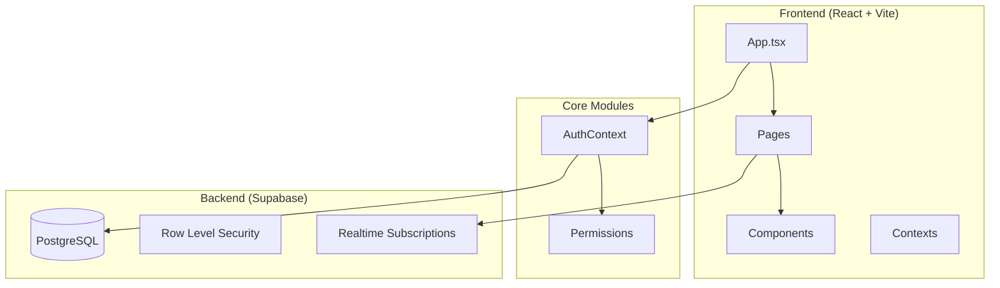
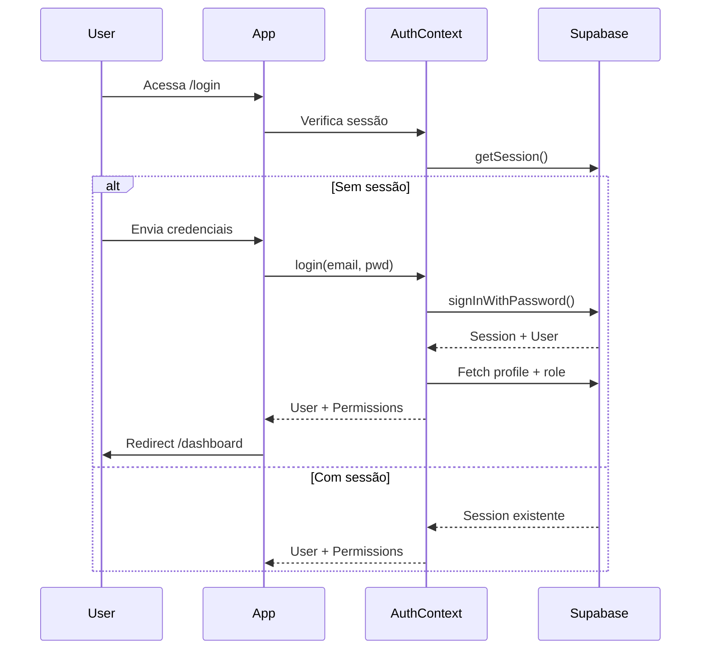

# OtavioAi - Documentação Técnica

## Visão Geral do Sistema

**OtavioAi** é uma aplicação web de CRM/Pipeline desenvolvida em React + TypeScript para gerenciamento de leads, conversas de chat e cotações de produtos automotivos. Integra com Supabase para autenticação e persistência de dados.

---

## Arquitetura

---

## Estrutura de Diretórios

| Diretório | Propósito |
|-----------|-----------|
| `/pages` | Páginas da aplicação (11 arquivos) |
| `/components` | Componentes reutilizáveis (12 arquivos) |
| `/contexts` | Context providers React |
| `/lib` | Utilitários e configuração Supabase |
| `/types` | Definições TypeScript |
| `/api` | Endpoints serverless |
| `/supabase` | Migrations SQL |

---

## Módulo de Autenticação

### [AuthContext.tsx](file:///c:/Users/camil/OneDrive/Documentos/Andre/projetos/OtavioAi/contexts/AuthContext.tsx)

Provider central que gerencia estado de autenticação, usuários e permissões.

#### Funções de Autenticação

| Função | Responsabilidade |
|--------|------------------|
| `login(email, password)` | Autentica usuário via Supabase ou mock data |
| `signup(email, password, name)` | Registra novo usuário (status "Pendente") |
| `logout()` | Encerra sessão e limpa estado |
| `resetPassword(email)` | Envia email de recuperação de senha |
| `updatePassword(password)` | Atualiza senha do usuário logado |

#### Funções de Gestão de Usuários

| Função | Responsabilidade |
|--------|------------------|
| `createUser(email, password, name, roleId)` | Cria usuário via API serverless |
| `updateUserRole(userId, roleId)` | Altera role de um usuário |
| `updateUserStatus(userId, status)` | Altera status (Ativo/Inativo/Pendente) |
| `deleteUser(userId)` | Soft delete (marca `deleted_at`) |
| `restoreUser(userId)` | Restaura usuário deletado |
| `approveUser(userId)` | Aprova usuário pendente → Ativo |

#### Funções de Gestão de Roles

| Função | Responsabilidade |
|--------|------------------|
| `createRole(name, description, permissions)` | Cria novo perfil com permissões |
| `updateRole(roleId, name, description, permissions)` | Atualiza perfil existente |
| `deleteRole(roleId)` | Remove perfil (exceto system roles) |
| `getRolePermissions(roleId)` | Retorna permissões de um perfil |

#### Funções Internas

| Função | Responsabilidade |
|--------|------------------|
| `handleSession(session)` | Processa sessão Supabase e carrega dados |
| `fetchUserPermissions(roleId)` | Carrega permissões do role do usuário |
| `fetchAllUsers()` | Lista todos usuários (admin only) |
| `fetchRoles()` | Lista todos perfis disponíveis |

---

## Módulo de Permissões

### [permissions.ts](file:///c:/Users/camil/OneDrive/Documentos/Andre/projetos/OtavioAi/lib/permissions.ts)

Utilitários para controle de acesso baseado em rotas.

| Função | Responsabilidade |
|--------|------------------|
| `canAccessRoute(permissions, path)` | Verifica se usuário pode acessar uma rota |
| `hasPermission(permissions, key)` | Verifica se usuário tem permissão específica |
| `filterNavigation(navItems, permissions)` | Filtra menu baseado em permissões |

#### Mapeamento de Rotas

| Rota | Permissão |
|------|-----------|
| `/dashboard` | dashboard |
| `/insights` | insights |
| `/pipeline` | pipeline |
| `/chat` | chat |
| `/leads` | leads |
| `/knowledge` | knowledge |
| `/users` | users |

---

## Páginas

### [Dashboard.tsx](file:///c:/Users/camil/OneDrive/Documentos/Andre/projetos/OtavioAi/pages/Dashboard.tsx)
Página inicial com KPIs, gráficos de tendência e interações recentes.

**Funções:**
- `fetchDashboardData()` - Carrega estatísticas filtradas por período

### [Chat.tsx](file:///c:/Users/camil/OneDrive/Documentos/Andre/projetos/OtavioAi/pages/Chat.tsx)
Interface de chat com clientes via WhatsApp/N8N.

**Funções:**
- `fetchSessions()` - Lista sessões de chat com filtros
- `fetchMessages(sessionId)` - Carrega histórico de mensagens
- `sendMessage(content)` - Envia mensagem (placeholder)
- `cleanMessageContent(content)` - Remove logs de ferramentas do conteúdo

### [Pipeline.tsx](file:///c:/Users/camil/OneDrive/Documentos/Andre/projetos/OtavioAi/pages/Pipeline.tsx)
Kanban de produtos com colunas de status.

**Funções:**
- `fetchProducts()` - Carrega produtos com filtros
- `handleCardClick(card)` - Abre detalhes do produto
- `handleVerify(requestId)` - Marca produto como verificado
- `handleArchive(requestId)` - Arquiva request

### [UserManagement.tsx](file:///c:/Users/camil/OneDrive/Documentos/Andre/projetos/OtavioAi/pages/UserManagement.tsx)
Gestão de usuários e perfis (admin only).

**Abas:**
- Usuários: lista, ativa, desativa, deleta, restaura
- Perfis: cria, edita, remove roles com permissões

### [Insights.tsx](file:///c:/Users/camil/OneDrive/Documentos/Andre/projetos/OtavioAi/pages/Insights.tsx)
Análises e relatórios detalhados.

### [Leads.tsx](file:///c:/Users/camil/OneDrive/Documentos/Andre/projetos/OtavioAi/pages/Leads.tsx)
Lista de leads/clientes.

### [Knowledge.tsx](file:///c:/Users/camil/OneDrive/Documentos/Andre/projetos/OtavioAi/pages/Knowledge.tsx)
Base de conhecimento com upload de documentos e URLs.

---

## Componentes Reutilizáveis

| Componente | Responsabilidade |
|------------|------------------|
| [ProtectedRoute](file:///c:/Users/camil/OneDrive/Documentos/Andre/projetos/OtavioAi/components/ProtectedRoute.tsx) | Protege rotas que requerem autenticação |
| [AdminRoute](file:///c:/Users/camil/OneDrive/Documentos/Andre/projetos/OtavioAi/components/AdminRoute.tsx) | Protege rotas admin (verifica permissão 'users') |
| [StatCard](file:///c:/Users/camil/OneDrive/Documentos/Andre/projetos/OtavioAi/components/StatCard.tsx) | Card de estatística com ícone e progresso |
| [ChatStatCard](file:///c:/Users/camil/OneDrive/Documentos/Andre/projetos/OtavioAi/components/ChatStatCard.tsx) | Card de estatística para página de chat |
| [CategoryBar](file:///c:/Users/camil/OneDrive/Documentos/Andre/projetos/OtavioAi/components/CategoryBar.tsx) | Barra de progresso com label |
| [FilterButton](file:///c:/Users/camil/OneDrive/Documentos/Andre/projetos/OtavioAi/components/FilterButton.tsx) | Botão de filtro toggle |
| [StatusBadge](file:///c:/Users/camil/OneDrive/Documentos/Andre/projetos/OtavioAi/components/StatusBadge.tsx) | Badge de status colorido |
| [ActionMenu](file:///c:/Users/camil/OneDrive/Documentos/Andre/projetos/OtavioAi/components/ActionMenu.tsx) | Menu de ações dropdown |
| [InteractionItem](file:///c:/Users/camil/OneDrive/Documentos/Andre/projetos/OtavioAi/components/InteractionItem.tsx) | Item de interação recente |
| [PipelineDetailsSidebar](file:///c:/Users/camil/OneDrive/Documentos/Andre/projetos/OtavioAi/components/PipelineDetailsSidebar.tsx) | Sidebar com detalhes do produto |
| [UserModal](file:///c:/Users/camil/OneDrive/Documentos/Andre/projetos/OtavioAi/components/UserModal.tsx) | Modal para criar/editar usuário |
| [ProfileModal](file:///c:/Users/camil/OneDrive/Documentos/Andre/projetos/OtavioAi/components/ProfileModal.tsx) | Modal para criar/editar perfil |

---

## Tipos TypeScript

### [authTypes.ts](file:///c:/Users/camil/OneDrive/Documentos/Andre/projetos/OtavioAi/types/authTypes.ts)

| Tipo | Descrição |
|------|-----------|
| `User` | Dados do usuário (id, name, email, role, status) |
| `Role` | Definição de perfil (id, name, description, isSystem) |
| `UserStatus` | 'Ativo' \| 'Inativo' \| 'Pendente' |
| `MenuPermissions` | Record de permissões (route_key → boolean) |
| `AuthContextType` | Interface do context de autenticação |

### [chat.ts](file:///c:/Users/camil/OneDrive/Documentos/Andre/projetos/OtavioAi/types/chat.ts)

| Tipo | Descrição |
|------|-----------|
| `Message` | Mensagem de chat (id, session_id, content) |
| `ClientSession` | Sessão de cliente (whatsapp, name, last_message) |
| `N8NMessageContent` | Estrutura de mensagem N8N |

### [pipeline.ts](file:///c:/Users/camil/OneDrive/Documentos/Andre/projetos/OtavioAi/types/pipeline.ts)

| Tipo | Descrição |
|------|-----------|
| `PipelineRequest` | Request de produto completo |
| `PipelineProduct` | Produto com dados de estoque |
| `PipelineClient` | Cliente associado ao request |
| `DateRangeOption` | Opções de filtro de período |
| `VerificationFilter` | Filtro de verificação |

---

## Integração Supabase

### Tabelas Principais

| Tabela | Propósito |
|--------|-----------|
| `profiles` | Perfis de usuário (extensão auth.users) |
| `roles` | Definição de perfis/cargos |
| `role_permissions` | Permissões por role |
| `clients` | Cadastro de clientes |
| `requests` | Solicitações/cotações |
| `requests_products` | Produtos das solicitações |
| `stock_products` | Catálogo de estoque |
| `suppliers` | Fornecedores |
| `n8n_chat_histories` | Histórico de chat N8N |

### Row Level Security (RLS)

Políticas implementadas nos arquivos SQL em `/supabase`:
- Usuários só acessam dados conforme seu role
- Admins têm acesso total
- Profiles são vinculados a auth.users via trigger

---

## Fluxo de Autenticação

---

## Dependências

| Pacote | Versão | Propósito |
|--------|--------|-----------|
| react | ^19.2.3 | Framework UI |
| react-router-dom | ^7.12.0 | Roteamento SPA |
| @supabase/supabase-js | ^2.90.1 | Cliente Supabase |
| recharts | ^3.6.0 | Gráficos |
| vite | ^6.2.0 | Build tool |
| typescript | ~5.8.2 | Type checking |

---

## Scripts NPM

| Comando | Ação |
|---------|------|
| `npm run dev` | Inicia servidor de desenvolvimento |
| `npm run build` | Gera build de produção |
| `npm run preview` | Preview do build |
